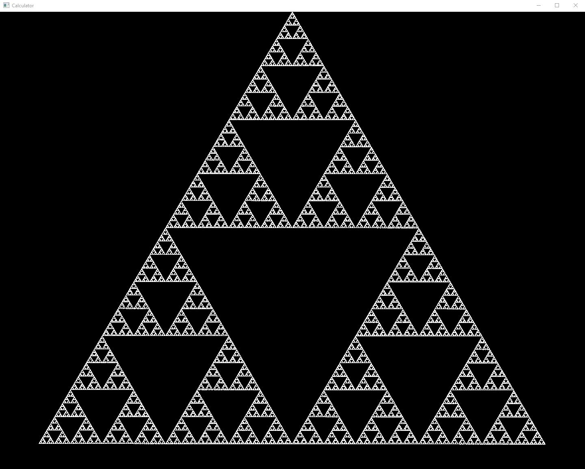
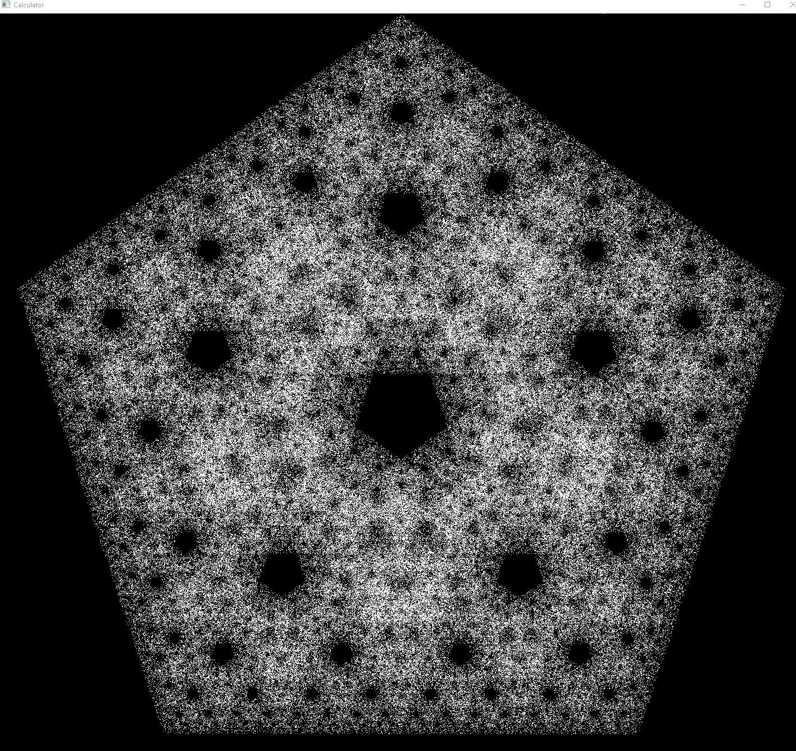

Program that creates geometric figures like Sierpinski triangle.
Changing points variable in main.cpp (line 19) to other than 3, program can create other figures like Sierpinski triangle
examples:
points = 3

points = 5

Program uses OpenGL glad and WinApi
